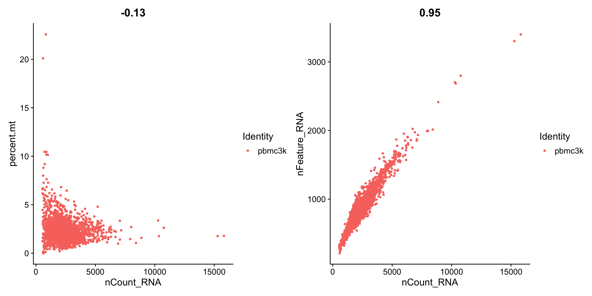
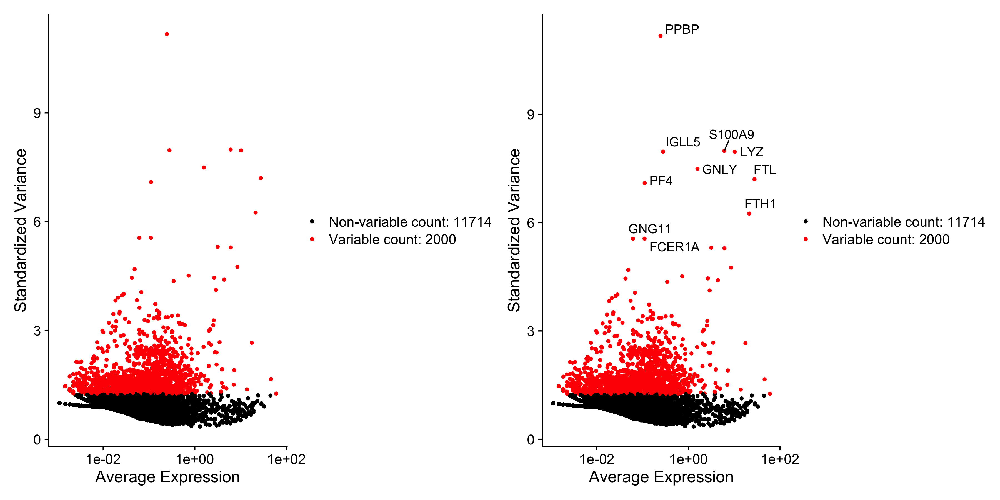

# GitHub Actions Example

This repository demonstrates an example of GitHub actions. The workflow is triggered on every push to the repository. 

## Workflow 1
A Simple R analysis, generating a random data set, and plotting it with ggplot2. We then save the data as a csv and the plot as a png.

## Workflow 2
As Bioinformatics is at the core of INSiGENe's business, we also demonstrate running at least part of the standard `Seurat` analysis pipeline via GitHub 
Actions. This of course will not be feasible for (a) data with ethics concerns (b) larger data sets. 

The Seurat workflow will prodyce the following plots:

